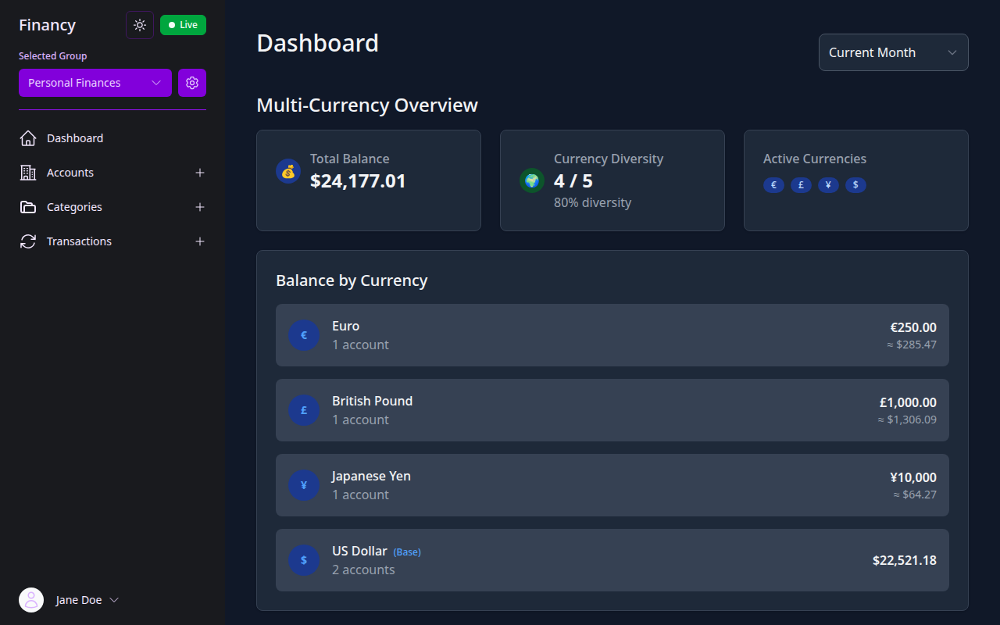

<div align="center">

# Financy

**Self-hosted finance tracker for a person or a family, in any mix of
currencies.**

[](https://ci.antonshubin.com/repos/1)
[](LICENSE)

[Features](docs/2.features.md) · [Roadmap](docs/roadmap.md) ·
[Architecture](docs/3.architecture.md) · [Development](docs/development.md) ·
[All docs](docs/README.md)



</div>

**Status: work in progress, not ready for everyday use.** Development resumes in
October 2026. Password reset and two-factor authentication are still in progress
— see [docs/roadmap.md](docs/roadmap.md) for what is built versus still planned.

You record income, expenses and transfers in accounts of any currency, and
Financy shows every balance in the currency you picked as the group's base. A
group is a household or a shared budget: its members see each change live, on
the phone or the desktop, without reloading.

Financy exists because a family's money rarely sits in one currency or with one
person. It targets multi-currency accounts and group or family collaboration
with role-based access (see [docs/1.principles.md](docs/1.principles.md),
[docs/2.features.md](docs/2.features.md) and
[docs/3.architecture.md](docs/3.architecture.md)). If you need something
finished today, use Actual Budget or Firefly III instead.

## Why Financy

- **Every currency, one total.** Each transaction keeps its original amount and
  currency next to the converted one.
- **Shared by design.** Groups with member roles; role-based access is partly
  built.
- **Live everywhere.** Changes travel over WebSockets, so every open device
  updates at once.
- **Transfers that add up.** A transfer between accounts is recorded as two
  linked transactions, following double-entry principles for that feature (see
  [transfer accounting](docs/features/transfer-accounting-overview.md)).
- **Budgets per category.** Set a monthly limit and watch spending against it on
  the dashboard.
- **Yours to host.** An installable web app (PWA) with its API, PostgreSQL and
  Valkey in Docker Compose on your own server.

**Use it if** you want to follow its development or help shape a self-hosted,
multi-currency family finance app. **Skip it if** you need a finished budgeting
tool today.

## Quick start

Requires [Deno](https://deno.com/) and [Docker](https://www.docker.com/) or
Podman.

```bash
git clone https://github.com/spy4x/financy.git && cd financy
cp infra/envs/.env.example infra/envs/.env   # fill in the values
docker network create proxy                  # once; Compose needs it
deno task compose up -d
```

`infra/envs/.env` picks Docker or Podman (`CONTAINER_PROVIDER`) and the dev or
prod stack (`ENV`). What each step does and why:
[docs/development.md](docs/development.md#running-the-stack). Deployment:
[docs/5.deployment.md](docs/5.deployment.md).

## Development

```bash
deno task compose up -d   # the whole stack, with hot reload in dev
deno task check           # lint, format, type check and tests
```

Encrypted env files, the tech stack and the rest of the reference are in
[docs/development.md](docs/development.md). Contributions: see
[CONTRIBUTING.md](CONTRIBUTING.md).

## Built by

I'm [Anton Shubin](https://antonshubin.com), a senior full-stack engineer and
tech lead. Financy is one of the tools I build in the open. Need something like
it built for your product? [That's my day job →](https://antonshubin.com)

Copyright (C) 2026 Anton Shubin. Licensed under [AGPL-3.0](LICENSE).
Contribution terms are in [CONTRIBUTING.md](CONTRIBUTING.md).

---

Made by Anton Shubin · [antonshubin.com/tools](https://antonshubin.com/tools)
