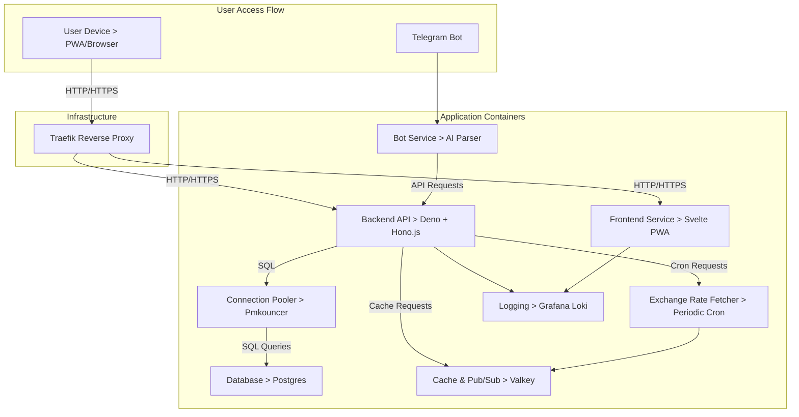
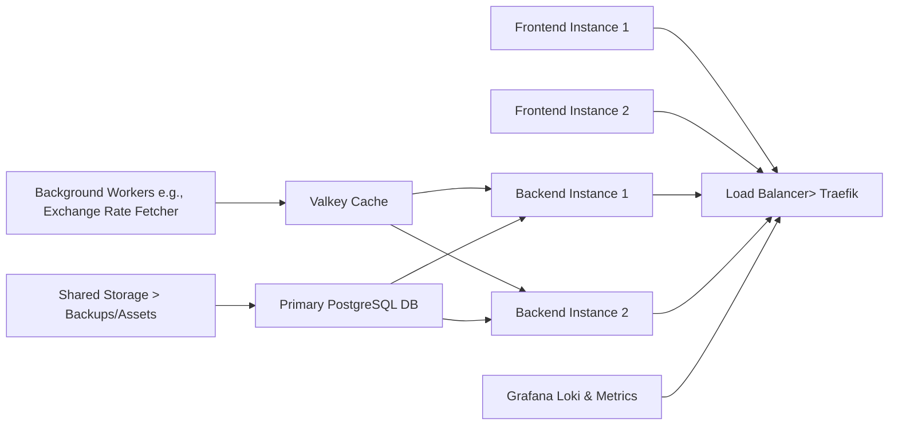

# Infrastructure

## Infrastructure Goals

1. **Flexibility and Modularity**:
   - Components are containerized to allow portability (local dev vs. cloud
     hosting).
   - Scalable architecture to handle traffic and data increases by scaling
     specific portions of the stack (e.g., backend API or Valkey). -server
     installs and pathways to multi-machine setups.
2. **Self-Hostable by Design**:
   - Users can deploy the stack locally or on cloud providers with minimal
     environment setup.
   - Documentation will cover single

3. **Cloud-Ready**:
   - Uses load balancers, caching layers, and logging to support seamless
     scaling as traffic grows.
   - Prepared for clusters in Docker Swarm or Kubernetes.

## Layers Overview

1. **Frontend**

- Served as a **PWA** from Dockerized containers.
- Handles offline-first transaction additions, caching UI and static assets.
- Deployed behind a **Traefik reverse proxy**.

2. **Backend API**

- Deno-based REST API for handling business logic.
- Stateless, horizontally scalable Docker service.
- Serves frontend needs (transactions, groups, accounts) and sync logic.

3. **Database**

- PostgreSQL powers the relational data backend.
- PgBouncer connection pooler sits between the API and the database for scaling
  connections.
- Valkey is used for:
  - High-performance caching (e.g., exchange rates, frequent queries).
  - Pub/Sub capabilities for WebSocket-based notifications (future).

4. **Bot Service**

- Telegram bot logic is containerized separately.
- Independent business logic to parse natural language inputs and forward
  structured data to the backend API.
- Scalable container makes it easy to grow as bot usage increases.

5. **Monitoring and Logging**

- Grafana Loki for centralized log aggregation.
- Tracks metrics for debugging and performance monitoring (e.g., API usage,
  errors, or slow queries).

## Docker-Based Stack Overview

The entire application stack runs via **Docker Compose** for simplicity. All the
services are self-contained and connected via internal networks.

---

## Component Overview

1. **Traefik Reverse Proxy**

- Acts as the entry point for all traffic.
- **Features**:
  - Manages routing between frontend, backend, and bot services.
  - Configured for HTTPS using Let's Encrypt for automatic certificate
    generation.
- Can handle:
  - Load balancing for horizontal scaling (e.g., multiple backend API
    containers).
  - Dynamic container discovery via Docker labels.
- **Why Traefik?**
  - Lightweight, fast, and built specifically for container workflows.
  - Easily extensible in Kubernetes for multi-node deployment.

---

2. **Frontend Service**

- **PWA (Progressive Web App)** served as static assets:
  - Caches assets locally on user devices to reduce server hits.
  - Offline functionality restricted to un-synced transaction additions.
- Responsive, mobile-first design delivered using **SvelteKit**.
- Future native app builds may use **Capacitor** for wrapping the PWA into
  Android/iOS apps.
- Integrated with backend API for real-time data sync upon reconnection.

---

3. **Backend API**

- Stateless business logic layer built with **Deno** + **Hono.js**.
- Exposed as REST API endpoints for:
  - CRUD operations (groups, transactions, accounts, etc.).
  - Batch sync mechanisms for offline transactions.
  - Role-based access control (RBAC) enforcement.
- **Horizontal Scalability**:
  - Stateless architecture means additional containers can be spun up to handle
    API load spikes.
  - Valkey used for shared data caching across multiple API instances.
- **WebSocket or Server-Sent Events (Optional Future Feature)**:
  - Valkey Pub/Sub provides the foundation for adding real-time notifications of
    shared group activities.

---

4. **PostgreSQL Database**

- Core relational database that stores all structured app data.
- **Monetary Value Precision**:
  - Handles financial transactions with precision by using integer-based
    smallest currency unit storage.
- **Connection Pooling**:
  - Uses PgBouncer to limit the load directly on the database and reduce
    resource consumption during high query volumes.
- **Backup Support**:
  - Users can export all app data into a single SQL dump and restore later (as
    separate accounts/groups).

---

5. **Valkey Cache**

- Alternate persistence layer for frequently accessed or volatile data.
- **Caching**:
  - Speeds up response times for frequent queries like user group data, exchange
    rates, or category lists.
- **Pub/Sub Support**:
  - Prepares the stack for live communication (e.g., real-time notifications for
    bot responses or shared group events).

---

6. **Telegram Bot**

- Deployed as a separate service for modularity and horizontal scalability.
- Responsibilities:
  - Parse commands like "Add $50 for food" into structured data.
  - Handle errors by falling back to defaults and promptly notifying users.
  - Forward valid data into the backend API for permanent storage.
- **Scaling**:
  - High usage rates trigger deployment of additional bot containers behind a
    load balancer.

---

7. **Monitoring and Logs**

- **Grafana Loki**:
  - Centralized logging system collects logs from the frontend, API, and bot
    services.
  - Tracks:
    - User errors (e.g., bot parsing failures).
    - Backend or database performance bottlenecks.
    - Infrastructure health for cloud-based deployments.
- Provides clear insights into maintenance or debugging needs.

---

## Future Cloud Deployment Path (Scaling Out)

Once a single-machine setup reaches its limits, the infrastructure can evolve
into a multi-node architecture using **Docker Swarm** or **Kubernetes**. This
enables more robust scaling and resilience.

**Key Features of Cloud Deployment**:

1. **Multiple Load-Balanced Instances**:
   - Frontend and backend deploy horizontally to handle increased traffic.
2. **Database Resilience**:
   - Primary database with replication (e.g., read replicas for reporting).
3. **Container Orchestration**:
   - Managed by Kubernetes for node-level recovery and replication.

---

## DevOps Tools and Practices

1. **Containerization**:
   - Docker images for all services, minimizing configuration inconsistencies
     between environments.
2. **CI/CD Pipeline**:
   - Automated builds and deployment via GitHub Actions or GitLab CI to ensure
     every code change is thoroughly tested and delivered cleanly.
3. **Environment Isolation**:
   - Separate environments for Development, Staging, and Production to ensure
     new features are safely tested before release.
